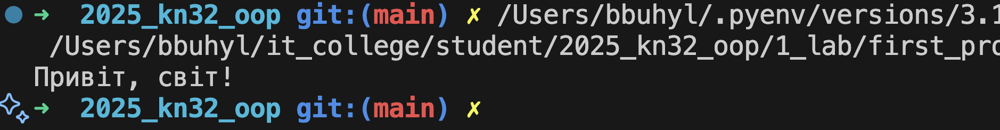
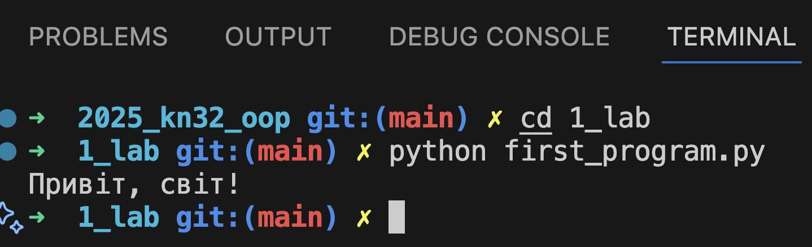

# Звіт до роботи
## Тема: _Вступні заняття: налаштування середовища, прочаток роботи з Python_
### Мета роботи: _Налаштувати середовище роботи VS Code, створити репозиторій Github та налаштувати інтеграцію з ним, написати першу програму на Python та створити звіт з використанням форматування Markdown_

---
### Виконання роботи
* Результати виконання завданнь:
    1. Створили заготовку для звіту та перші файли Python для написання програм;
    1. Доінсталювали плагіни та почали працювати з VSCode;
    1. запитали в АІ про першу програму
        - Запустили програму за допомогою копки Run 
        - Запустили програму з консолі 
    1. Програма вивела значення ...
    1. Отримано наступні результати ...
    1. Навчились ...
* вставлені рисунки (скріншоти екрана або фотографії виконаного завдання у зошиті);
    > якщо графічних файлів багато то краще помістити їх у  окрему папку, наприклад у мене це папка `pictures`. Уважно   дивіться коли вставляєте URL - файл має бути представленим    як `raw`. А краще користуйтесь локальними шляхами!

* з використанням URL 
    
* через локальні шляхи 

* вставлений код / текстовий або числовий результат / інші результати:
    - так можна вставляти код, або просто вствляйте посилання на файл з програмою;
    ```python
    def simple_function_example():
        pass
    ```
    - якщо потрібно виділити текст, тоді:
    ```text
    << Тут можна писати те що хочемо виокремити >>
    ```

* результати виконання індивідуального завдання (якщо такі є);

---
### Висновок:
> у висновку потрібно відповісти на запитання:

- :question: Що зроблено в роботі;
- :question: Чи досягнуто мети роботи;
- :question: Які нові знання отримано;
- :question: Чи вдалось відповісти на всі питання задані в ході роботи;
- :question: Чи вдалося виконати всі завдання;
- :question: Чи виникли складності у виконанні завдання;
- :question: Чи подобається такий формат здачі роботи (Feedback);
- :question: Побажання для покращення (Suggestions);

---