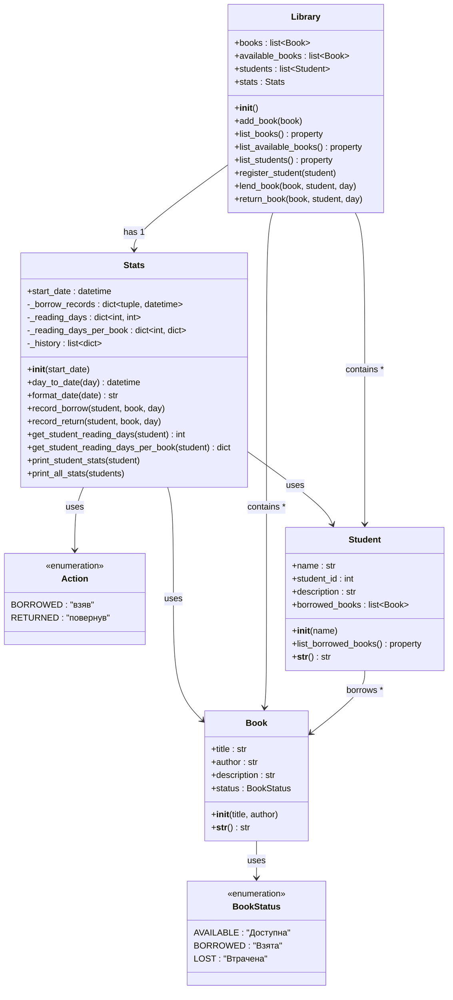
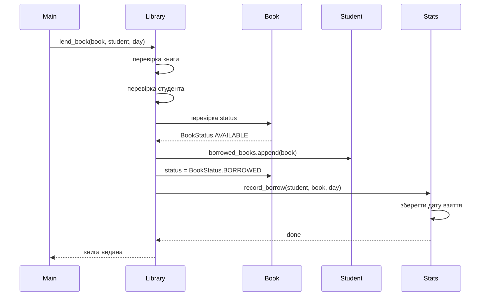
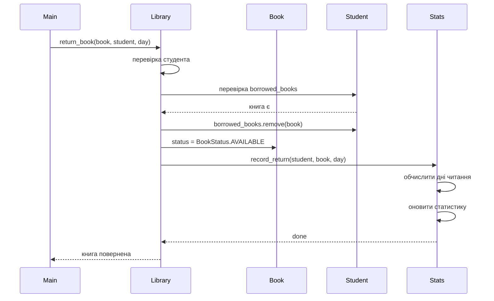

# UML діаграма класів проекту "Бібліотека"

## Опис зв'язків

| Зв'язок | Тип | Опис |
|---------|-----|------|
| Library → Book | Композиція (1:*) | Бібліотека містить багато книг |
| Library → Student | Композиція (1:*) | Бібліотека містить багато студентів |
| Library → Stats | Композиція (1:1) | Бібліотека має один об'єкт статистики |
| Student → Book | Асоціація (*:*) | Студент може мати багато книг |
| Book → BookStatus | Залежність | Книга використовує статус |
| Stats → Action | Залежність | Статистика використовує типи дій |

## Діаграма послідовності: Взяття книги

## Діаграма послідовності: Повернення книги

