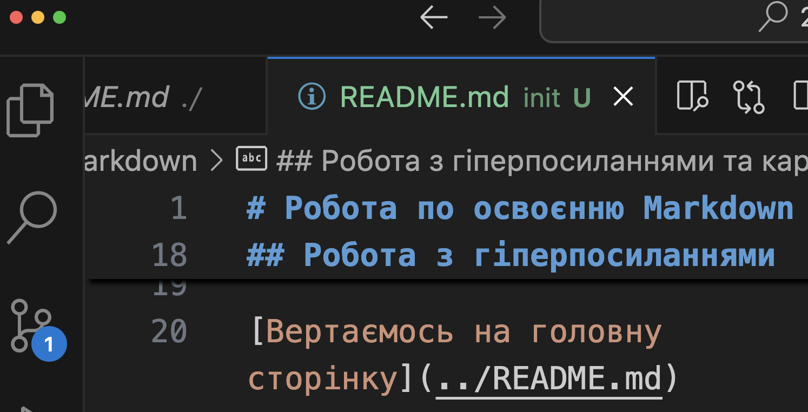

# Робота по освоєнню Markdown

> [!TIP]
> це цитування або наголошення

## Пробуємо працювати з текстом
Це буде простий текст
і далі ми _продовжуємо_ писати в єдиному рядку.  
Це вже буде у новому рядку.

Або для **_створення_ *абзацу* просто** залишаємо пустий "рядок".

## Створення списків
1. Пробуємо список
3. Вставляємо  новий рядок -> Починаємо з простого
    + це підпункт ненумерованого списку
    - Це також буде крапка
    * **Чому зірка також крапка**?
1. Це вже другий елемент списка
4. Чому номер списку йде по порядку?

## Робота з гіперпосиланнями та картинками

[Вертаємось на головну сторінку](../README.md)

[повернутись на початок файлу](#робота-по-освоєнню-markdown "Ти впевнений?")

- Вчимось робити скріни та вставляти їх 

- А це другий скрін


## Втавка блоків коду
```python
print("Hello")
```

---
